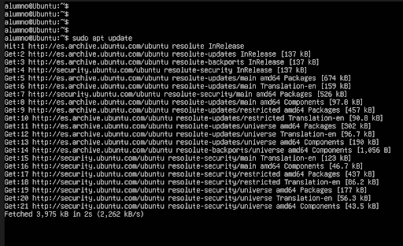
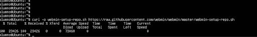
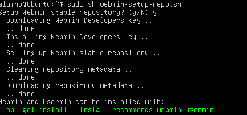
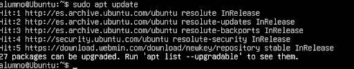
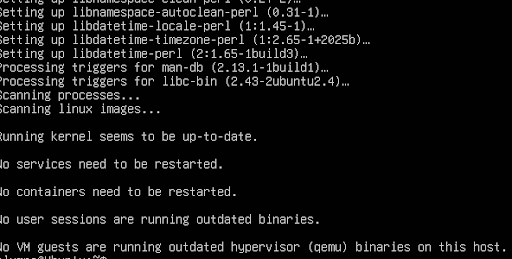
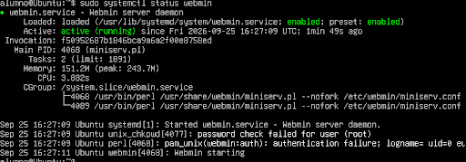
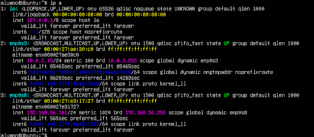
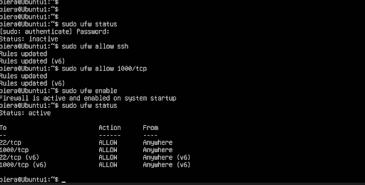
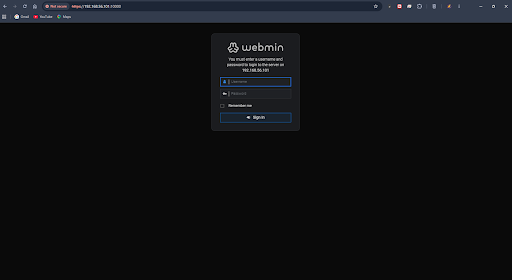
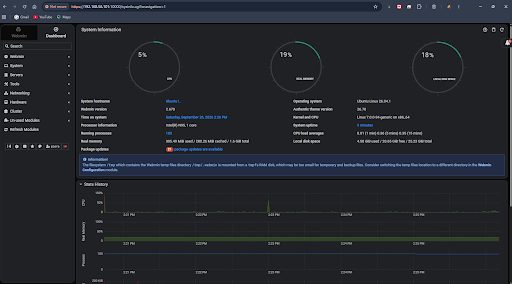

# PR0102 - Instalación y configuración de Webmin

## 1. Actualizar los repositorios

Primero actualizamos la información de los repositorios de Ubuntu:

```bash
sudo apt update
```



---

## 2. Instalar curl

Instalamos `curl`, que utilizaremos para descargar el script de configuración de Webmin:

```bash
sudo apt install curl
```



---

## 3. Descargar el script de Webmin

Descargamos el script oficial para configurar el repositorio de Webmin:

```bash
curl -O https://raw.githubusercontent.com/webmin/webmin/master/webmin-setup-repo.sh
```


---

## 4. Configurar el repositorio

Ejecutamos el script descargado:

```bash
sudo sh webmin-setup-repo.sh
```



---

## 5. Actualizar los repositorios

Después de añadir el repositorio de Webmin, volvemos a actualizar los repositorios:

```bash
sudo apt update
```



---

## 6. Instalar Webmin

Instalamos Webmin con:

```bash
sudo apt-get install webmin --install-recommends
```

La opción `--install-recommends` instala también los paquetes recomendados para Webmin.



---

## 7. Comprobar que Webmin está funcionando

Comprobamos el estado del servicio:

```bash
sudo systemctl status webmin
```

El servicio debe aparecer como:

```text
Active: active (running)
```



---

## 8. Obtener la dirección IP del servidor

Para consultar las interfaces de red y las direcciones IP utilizamos:

```bash
ip a
```

La dirección utilizada para acceder al servidor fue:

```text
192.168.56.101
```



---

## 9. Configurar el firewall

Permitimos las conexiones SSH:

```bash
sudo ufw allow ssh
```

Permitimos el puerto utilizado por Webmin:

```bash
sudo ufw allow 10000/tcp
```

Activamos el firewall:

```bash
sudo ufw enable
```

Y comprobamos su estado:

```bash
sudo ufw status
```



---

## 10. Acceder a Webmin

Desde el navegador accedemos a:

```text
https://192.168.56.101:10000
```

El puerto `10000` es el utilizado por Webmin.

Al acceder por primera vez puede aparecer un aviso del navegador relacionado con el certificado HTTPS.






---

## 11. Automatización

Todos los pasos principales de instalación y configuración se han automatizado mediante un script Bash situado en:

```text
webmin-install.sh
```

Para darle permisos de ejecución:

```bash
chmod +x webmin-install.sh
```

Y para ejecutarlo:

```bash
./webmin-install.sh
```

El script permite realizar la instalación sin tener que introducir manualmente todos los comandos.
